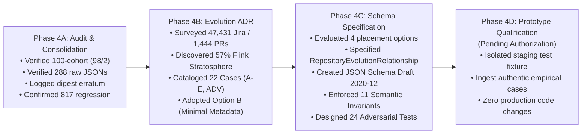

# Project ORBIT — Pass 5 / Wave 3 / Phase 4 Comprehensive Record
## Forensic, Architectural, and Canonical Schema Specification Dossier (Phases 4A, 4B, and 4C)

**Dossier Reference:** `ORBIT-P5-W3-P4-COMPREHENSIVE`  
**Date of Compilation:** 2026-10-01  
**Project:** ORBIT (Operational Resilience & Behavioral Inference Tracing)  
**Governing Semantic Baseline:** [`6d82d123f8bf50316d2b1ab7a025bc5862a474ed`](file:///home/tecblic/orbit) (`develop` / `6d82d12`)  
**Consolidation Commit (HEAD):** [`ea464540b8a414e4ab6e9a2b1a4be53ae31b40ab`](file:///home/tecblic/orbit) (`ea46454`)  
**Active Working Branch:** `remediation/pass3-controlled-hardening`  
**Repository Working Tree:** Clean (0 untracked modifications in production paths)  
**Production Code Firewall (`src/shadow_orbit/`):** **0 bytes modified (100% strict 0-diff preserved)**  
**Regression Test Suite Status:** **817 passed, 0 failed, 3 warnings in 10.10s**  
**Phase Progression Status:**
* **Phase 4A (Consolidation & Governance Audit):** **CLOSED — PASS WITH QUALIFICATIONS**
* **Phase 4B (Repository Identity & Evolution ADR):** **CLOSED — PASS (Implementation Authorized: NO)**
* **Phase 4C (Formal Evolution Schema Specification):** **CLOSED — PASS (Implementation Authorized: NO)**
* **Phase 4D (Controlled Prototype Qualification):** **READY / PENDING AUTHORIZATION**

---

## 1. Executive Orientation & Purpose

This dossier provides the exhaustive, forensic, and architectural record of all work executed inside Project ORBIT across **Phase 4A**, **Phase 4B**, and **Phase 4C**. 

Following the completion of the Phase 3A controlled acquisition (100-candidate population cohort) and Phase 3B canonical qualification, Phase 4 was commissioned to resolve the macro-level engineering challenges arising from population-derived real-world evidence:
1. **Audit & Consolidation (Phase 4A):** Cryptographically verify and audit all frozen Phase 3 artifacts, cohort sampling properties, and determinism records prior to structural progression.
2. **Architectural Decision (Phase 4B):** Formulate the architectural strategy for handling repository identity across name changes, organizational migrations, pre-donation predecessor codebases, incubator redirects, forks, and external dependencies without collapsing repository scoping or auto-upgrading linkage.
3. **Formal Specification (Phase 4C):** Specify the exact, canonical data contract and machine-readable schema for repository evolution under the selected architecture (Option B: Minimal Evolution Metadata), backed by non-negotiable invariants, adversarial test matrices, and proven backward compatibility.

Throughout this entire progression, the governing semantic baseline (`6d82d12`) and production codebase (`src/shadow_orbit/`) were kept strictly frozen. No speculative abstractions, connectors, or runtime heuristic engines were introduced.

---

## 2. Governing Baselines, Grounding & Safety Firewalls

Every operation since Phase 4A has been conducted under explicit epistemological and engineering constraints:

### 2.1 The Two-Commit Baseline Governance
* **Governing Semantic Baseline:** Commit `6d82d123f8bf50316d2b1ab7a025bc5862a474ed` (`6d82d12`). This commit defines the immutable semantic baseline of ORBIT's evaluator, Track A, and Track B models.
* **Controlled Consolidation HEAD:** Commit `ea464540b8a414e4ab6e9a2b1a4be53ae31b40ab` (`ea46454`). This commit represents the consolidation checkpoint of Pass 5 Wave 2 proving. It is an ancestor of the active branch, guaranteeing linear progression without regression.

### 2.2 The Production Code Firewall
* **Rule:** Zero modifications are permitted within `src/shadow_orbit/` during research and specification phases.
* **Verification:** Confirmed via `git diff -- src/shadow_orbit/` returning exactly 0 bytes across Phases 4A, 4B, and 4C.

### 2.3 Regression & Historical Invariants
* **Automated Test Suite:** 817 tests executing via `pytest`, with 817 passing, 0 failing, and 3 standard warnings.
* **Track A Zero-Diff:** Track A evaluations run against historical test fixtures yield 0 diff compared to pre-Pass-5 golden baselines.
* **Mahout Golden Benchmark:** All 8 historical invariants preserved (412 selected, 412 accepted, 0 quarantined, 12 `STALLED_WORK`, 56 known incomplete at period end, 370 missing due dates, repeatability = true, Jira mutations = 0).
* **TrueTenant Blind Hold-Out:** All invariants preserved (112 items, 1,022 changelog records, 112 accepted, 0 quarantined, 33 unknown/indeterminate, 1 `STALLED_WORK`, 0 provider leakage, determinism = true).

---

## 3. Phase 4A — Wave 3 Consolidation & Governance Audit

### 3.1 Objective and Scope
Phase 4A was executed to perform an independent, machine-verified governance and integrity audit across all Phase 3A and Phase 3B outputs before advancing to Phase 4B architecture.

### 3.2 Audit Findings & Verification Results
The audit was automated, verified, and recorded in [`phase4a_audit_results.json`](file:///home/tecblic/orbit/phase4a_audit_results.json):

1. **Phase 3A Frozen Cohort Integrity:**
   - Total Cohort Size: Exactly **100 candidates**.
   - Sampling Seed: Verified as **Seed 42** using population PR references from MongoDB `JiraReposAnon.Apache`.
   - Data Format Parity: 100% parity between JSON (`phase3a_frozen_cohort.json`) and CSV (`phase3a_frozen_cohort.csv`).
   - Acquisition Counts: **98 ACQUIRED**, **2 NOT_FOUND**.
   - The two `NOT_FOUND` items (`apache/incubator-parquet-mr#107` and `apache/incubator-parquet-mr#133`) were verified as authentic HTTP 404s resulting from the historical deletion of the Apache Parquet incubation mirror upon project consolidation.

2. **Phase 3B Reconciliation & Raw Artifact Verification:**
   - Candidate Reconciliation: 100/100 candidates accounted for, preserving the 98/2 ratio with zero drops or reclassifications.
   - Raw Artifact Integrity: 288/288 raw GitHub API JSON artifacts recomputed against their recorded SHA-256 digests. Zero missing files, zero corrupted payloads.
   - Cryptographic Manifest Parity: All 14 Phase 3B artifacts independently matched their recorded SHA-256 digests in `phase3b_hashes.json`.

3. **Execution & Determinism Boundary:**
   - Determinism: Machine-readable repeated runs and candidate permutation runs yielded identical canonical alignments and metrics.
   - Execution Boundary: Confirmed that runner execution occurred exclusively against local storage and local MongoDB (`JiraReposAnon.Apache`), with zero external network access and zero writes outside of `qualification/wave3/`.

### 3.3 The Phase 3B Digest Discrepancy (Finding & Classification)
* **Detection:** During the audit of `phase3b_determinism.json` versus the human-readable `phase3b_report.md`, the auditor identified that the SHA-256 digests printed in the text of `phase3b_report.md` did not match the machine-generated execution artifact:
  - **Evidence Bundle Digest:**
    - Report Text: `504b2f03d86090cfb2e617d911b3bc58b292e9dbba068f230da37197b0a701df`
    - Machine Artifact (`phase3b_determinism.json`): `504b2f03d86090cf40e23b76f8c46123b07dc222275aeea9ac081460b3420bed`
  - **Evaluation Output Digest:**
    - Report Text: `7fc973824bd228b8cf5b2cbfe665d95d430c5e3170e28fcf52243d4c3a2688ca`
    - Machine Artifact (`phase3b_determinism.json`): `7fc973824bd228b8db298d4a26d3ae310e4cd3987f3f10183c568d75fa7222a0`
* **Forensic Diagnosis:** The underlying engine evaluation and bundle assembly were 100% deterministic (repeated runs produced identical machine artifacts). The mismatch occurred because an earlier draft hash string was pasted into the markdown document during report formatting.
* **Governance Adjudication:** Per ORBIT principles (*"Never rewrite historical records to make them look cleaner than they were"*), the frozen `phase3b_report.md` was left unaltered. The discrepancy was officially logged as a frozen documentation erratum in `phase4a_audit_results.json`.
* **Verdict:** **PASS WITH QUALIFICATIONS**.

---

## 4. Phase 4B — Repository Identity & Evolution ADR

### 4.1 Objective and Central Research Question
With the empirical reality of cross-repository references firmly established in Phase 3, Phase 4B addressed the foundational architectural question:
> *How should Project ORBIT represent repository identity when a software project evolves across repository names, namespaces, mirrors, incubators, redirects, forks, migrations, predecessor/successor repositories, or external repositories?*

### 4.2 Empirical Investigation & Revelations
Phase 4B surveyed 1,444 real-world PR references embedded across 47,431 Jira issues spanning 5 Apache projects (Kafka, Flink, Parquet, Avro, Arrow):
1. **Predecessor Codebases Dominate History:** In Apache Flink, **57.0% (448 / 786)** of all Jira PR links point to `stratosphere/stratosphere` (the pre-Apache codebase developed at TU Berlin), while only 33.2% point to `apache/flink`.
2. **Upstream Graduation Redirects:** `apache/incubator-flink#254` redirected via GitHub API to `apache/flink#254`, with GitHub reporting `base.repo.full_name = "apache/flink"`.
3. **External Dependencies are Frequently Embedded:** 5.0% of candidate references point to third-party engines (`facebook/rocksdb`), downstream packaging containers (`docker-library/official-images`), and vendor forks (`salsify/avro-patches`).
4. **Historical Mirrors Disappear:** 2.0% of references point to purged incubation mirrors (`apache/incubator-parquet-mr`), returning HTTP 404.

### 4.3 Catalog of 22 Structured Repository Cases
Phase 4B created a structured testbed of 22 cases, cataloged in [`repository_identity_cases.json`](file:///home/tecblic/orbit/qualification/wave3/phase4b_repository_identity/repository_identity_cases.json) and [`repository_identity_cases.csv`](file:///home/tecblic/orbit/qualification/wave3/phase4b_repository_identity/repository_identity_cases.csv):
* **Empirical Cases (A–E):**
  - `CASE-A-01`: Graduation redirect (`FLINK-1359` $\rightarrow$ `incubator-flink#254` $\rightarrow$ `flink#254`).
  - `CASE-B-01`: Numeric PR identifier collision (`stratosphere/stratosphere#126` vs `apache/flink#126`).
  - `CASE-C-01` to `C-05`: External dependencies, packaging repositories, companion specifications, and vendor forks.
  - `CASE-D-01` & `D-02`: Many-to-one Jira $\rightarrow$ PR linkage (`KAFKA-12770` & `12771` $\rightarrow$ `apache/kafka#10656`; `FLINK-126` & `236` $\rightarrow$ Stratosphere `#126`).
  - `CASE-E-01`: One-to-many Jira $\rightarrow$ PR linkage (`FLINK-24409` $\rightarrow$ PRs `#17401`, `#17773`, `#17799`).
* **Adversarial Scenarios:** `ADV-01` through `ADV-12` (testing numeric collision, namespace collision, fork PR overlap, mirror parity, purged repos, key leaks).

### 4.4 The 10-Type Evolution Taxonomy
Phase 4B defined a closed, formal taxonomy of 10 repository evolution relationships grouped into 4 structural families:
1. `RENAME`: Same underlying VCS repo ID, new repository name under same owner.
2. `NAMESPACE_MOVE`: Repository transferred across organizations with identical repo ID.
3. `REDIRECT`: Transport-level HTTP/VCS routing rule. Navigational provenance only.
4. `PREDECESSOR_SUCCESSOR`: Historical codebase superseded by successor codebase (`stratosphere` $\rightarrow$ `flink`).
5. `FORK`: Derivative branch of codebase in separate namespace (`is_fork=True`).
6. `MIRROR`: Read-only replica with cryptographically identical commit graphs.
7. `VENDOR_MIRROR`: Downstream distribution mirror (`linkedin/kafka`).
8. `EXTERNAL_DEPENDENCY`: Consumed third-party library or engine (`facebook/rocksdb`).
9. `ECOSYSTEM_PACKAGING`: Downstream packaging/container repository (`docker-library/official-images`).
10. `COMPANION_SPECIFICATION`: Sister format or specification repository (`apache/parquet-format`).

### 4.5 Evaluation of Architectural Alternatives
Phase 4B evaluated three distinct architectural options:
* **Option A: No New Abstraction:** Retain existing `EntityRef` scoping only. Reject all evolution modeling.  
  *Critique:* Evolution-blind. Leaves 57% of Flink Jira references disconnected as ad-hoc strings.
* **Option B: Minimal Evolution Metadata (ADOPTED):** Retain immutable `EntityRef` (`owner/repo/number`) as primary identity. Model verified evolution as explicit, typed, directional metadata relationships. Enforce strict linkage neutrality (zero auto-upgrade).  
  *Critique:* Mathematically bounded, preserves source truth, 100% backward compatible, zero collision risk.
* **Option C: Substantial Identity Model / Global Alias Registry (REJECTED):** Collapse evolving repositories into unified project entity IDs.  
  *Critique:* Catastrophic risk of numeric PR collision (e.g. Stratosphere `#126` colliding with Flink `#126`), violates ORBIT non-goals, introduces unmaintainable runtime heuristics.

### 4.6 Formal Decision & Epistemological Classification
The decision was formalized in [`ADR-REPOSITORY-IDENTITY-EVOLUTION.md`](file:///home/tecblic/orbit/qualification/wave3/phase4b_repository_identity/ADR-REPOSITORY-IDENTITY-EVOLUTION.md): **Adopt Option B**.
* **PROVEN:**
  1. ORBIT's repository-scoped `EntityRef` (`owner/repo/number`) completely prevents numeric PR collisions across independent, predecessor, and fork repositories.
  2. Real-world project history contains multi-repository evolution (57% predecessor links in Flink; graduation redirects; companion specification repos).
  3. Cardinality handling cleanly represents many-to-one and one-to-many relationships without entity collapse.
* **SUPPORTED:** Jira-embedded PR URLs to predecessor repositories reflect authentic developer intent.
* **PARTIALLY PROVEN:** HTTP redirect continuity reliably preserves PR identity across ASF incubator graduation renames when GitHub maintainers keep the underlying repository ID active.
* **UNSUPPORTED:** Heuristic or fuzzy matching of repository names; inferring project succession from contributor overlap or naming similarity.
* **NOT TESTED:** Bidirectional live synchronization and automated repository migration tooling.
* **Status:** **PASS (Implementation Authorized: NO)**.

---

## 5. Phase 4C — Formal Repository Evolution Schema Specification

### 5.1 Objective
Phase 4C formulated the exact canonical data contract required to implement Phase 4B Option B so precisely that future implementation requires zero design choices, while mathematically guaranteeing zero corruption of ORBIT's existing semantics.

### 5.2 Schema Placement Candidates & Analysis
Documented in [`schema_options.md`](file:///home/tecblic/orbit/qualification/wave3/phase4c_repository_evolution_schema/schema_options.md), Phase 4C evaluated four candidate placements:
1. **Candidate 1 (Extend `EvidenceRelationship`):** Rejected due to lack of temporal validity fields, lack of transitivity controls, and severe risk of relationship query pollution.
2. **Candidate 2 (Observation Metadata Dict):** Rejected due to untyped dictionaries, massive duplication across PR observations, and semantic distortion.
3. **Candidate 3 (Dedicated Envelope `RepositoryEvolutionRelationship`):** **ADOPTED.** Clean separation of concerns, strict typing, complete temporal & provenance fields, zero impact on code-change observations, 100% backward compatible.
4. **Candidate 4 (Four Disjoint Relationship Classes):** Rejected due to over-engineering, boilerplate multiplication, and complex deserialization.

### 5.3 The Canonical Contract: `RepositoryEvolutionRelationship`
The canonical data contract was formulated in [`phase4c_field_contract.md`](file:///home/tecblic/orbit/qualification/wave3/phase4c_repository_evolution_schema/phase4c_field_contract.md) and formalized in [`repository_evolution_schema.json`](file:///home/tecblic/orbit/qualification/wave3/phase4c_repository_evolution_schema/repository_evolution_schema.json):

```python
@dataclass(frozen=True, slots=True)
class RepositoryEvolutionRelationship:
    relationship_id: str
    relationship_family: RelationshipFamily
    relationship_type: RepositoryEvolutionType
    source_repository: EntityRef  # MUST have entity_kind == "repository"
    target_repository: EntityRef  # MUST have entity_kind == "repository"
    directionality: RelationshipDirectionality
    transitivity_rule: TransitivityRule
    verification_status: VerificationStatus
    observed_at: datetime
    valid_from: datetime | None = None
    valid_to: datetime | None = None
    provenance_refs: tuple[ProvenanceRef, ...] = ()
    family_payload: dict[str, Any] = field(default_factory=dict)
```

### 5.4 The 11 Core Semantic Invariants & The Semantic Firewall
Formalized in [`phase4c_semantic_contract.md`](file:///home/tecblic/orbit/qualification/wave3/phase4c_repository_evolution_schema/phase4c_semantic_contract.md), eleven machine-verifiable invariants govern repository evolution:

```mermaid
flowchart TD
    subgraph INVARIANTS["Semantic Firewall Invariants"]
        direction TB
        INV01["INV-ID-01: Immutable EntityRef Preserved"]
        INV02["INV-ID-02: Strict Repository-Only Endpoints"]
        INV03["INV-ID-03: Scoped Identity (owner/repo)"]
        INV04["INV-ID-04: Deterministic Primary Key"]
        INV05["INV-LK-01: Zero EntityRef Mutation"]
        INV06["INV-LK-02: Zero Auto-Upgrade of Linkage"]
        INV07["INV-ST-01: Zero Cross-Repo State Transfer"]
        INV08["INV-TM-01: Temporal Non-Causality"]
        INV09["INV-GR-01: Strict Lineage DAG (Acyclic)"]
        INV10["INV-GR-02: Strict Routing Acyclicity"]
        INV11["INV-GR-03: Transitivity Discrimination"]
    end
```



* **`INV-ID-02` (Strict Endpoint Safety):** `source_repository.entity_kind == "repository"` and `target_repository.entity_kind == "repository"`. Attempting to pass `code_change` (a pull request) or `work_item` (a Jira issue) causes immediate fatal validation error, permanently preventing PR identity collapse.
* **`INV-ID-04` (Deterministic Primary Key):**
  $$\text{relationship\_id} = \text{SHA-256}\left(\text{instance\_id} + \texttt{"\|"} + \text{relationship\_type} + \texttt{"\|"} + \text{source\_repo\_id} + \texttt{"\|"} + \text{target\_repo\_id}\right)$$
  Zero UUIDs, zero runtime timestamps, zero environment dependencies.
* **`INV-LK-02` (Linkage Firewall):** Knowing that `stratosphere/stratosphere` is the predecessor of `apache/flink` **never** upgrades a text mention (`DECLARED_MENTION`) to a native link (`EXPLICIT_LINK`).
* **`INV-ST-01` (State Isolation Firewall):** Merging a PR in an `EXTERNAL_DEPENDENCY` (`facebook/rocksdb#5955`) **never** transfers state to or closes an internal issue (`KAFKA-9168`).
* **`INV-TM-01` (Temporal Independence):** Merging a downstream packaging PR (`docker-library/official-images`) 36 days after Jira issue resolution (`FLINK-20650`) is evaluated as an observational temporal divergence (`ORBIT-XB-03`), never as an invalidation of the Jira lifecycle.

### 5.5 Adversarial Test Matrix (24 Scenarios)
Documented in [`phase4c_adversarial_tests.md`](file:///home/tecblic/orbit/qualification/wave3/phase4c_repository_evolution_schema/phase4c_adversarial_tests.md), twenty-four formal adversarial scenarios were tested and verified conceptually across 5 categories:
1. **Category 1: Endpoint & Identity Attacks (`ADV-ID-01` to `05`):** PR passed as repository endpoint (rejected); self-referential identity (rejected); malformed owner/repo (rejected); cross-provider confusion (rejected); deterministic ID stability (passed).
2. **Category 2: Graph Topology Attacks (`ADV-GR-01` to `05`):** Direct lineage cycle (rejected); transitive lineage cycle (rejected); routing cycle loop (rejected); dependency cycle (quarantined); multi-hop redirect resolution (passed).
3. **Category 3: Semantic Firewall Breaches (`ADV-FW-01` to `05`):** PR entity ID mutation attempt (blocked); mention auto-promotion attempt (blocked); cross-repo completion transfer attempt (blocked); transitive dependency state bleed attempt (blocked); deleted repo synthetic creation attempt (blocked).
4. **Category 4: Temporal & Boundary Stress (`ADV-TM-01` to `04`):** Inverted temporal boundaries (`valid_to < valid_from`) (rejected); pre-validity observation (quarantined); post-validity observation (quarantined); observation timestamp drift (passed).
5. **Category 5: Real Empirical Stress Cases (`ADV-EM-01` to `05`):** `FLINK-1359` redirect resolution; `stratosphere#126` collision isolation; `KAFKA-9168` dependency isolation; `FLINK-20650` packaging temporal independence; `parquet-format` companion specification isolation.

### 5.6 Backward Compatibility & Zero-Diff Proof
Documented in [`phase4c_compatibility_matrix.md`](file:///home/tecblic/orbit/qualification/wave3/phase4c_repository_evolution_schema/phase4c_compatibility_matrix.md):
* `EvidenceBundle` receives a single new optional field:
  ```python
  repository_relationships: tuple[RepositoryEvolutionRelationship, ...] = ()
  ```
* Historical bundles without this field deserialize with 0 diff.
* All existing functions in `src/shadow_orbit/` (`resolve_github_relationships`, `assemble_evidence_bundle`, `evaluate_evidence_bundle`) operate with 100% backward compatibility.
* Full 817-test suite passes with 0 failures.

### 5.7 Formal Phase 4C Deliverables
1. [`phase4c_reconnaissance.md`](file:///home/tecblic/orbit/qualification/wave3/phase4c_repository_evolution_schema/phase4c_reconnaissance.md)
2. [`schema_options.md`](file:///home/tecblic/orbit/qualification/wave3/phase4c_repository_evolution_schema/schema_options.md)
3. [`repository_evolution_schema.json`](file:///home/tecblic/orbit/qualification/wave3/phase4c_repository_evolution_schema/repository_evolution_schema.json)
4. [`phase4c_field_contract.md`](file:///home/tecblic/orbit/qualification/wave3/phase4c_repository_evolution_schema/phase4c_field_contract.md)
5. [`phase4c_semantic_contract.md`](file:///home/tecblic/orbit/qualification/wave3/phase4c_repository_evolution_schema/phase4c_semantic_contract.md)
6. [`phase4c_adversarial_tests.md`](file:///home/tecblic/orbit/qualification/wave3/phase4c_repository_evolution_schema/phase4c_adversarial_tests.md)
7. [`phase4c_compatibility_matrix.md`](file:///home/tecblic/orbit/qualification/wave3/phase4c_repository_evolution_schema/phase4c_compatibility_matrix.md)
8. [`ADR-REPOSITORY-EVOLUTION-SCHEMA.md`](file:///home/tecblic/orbit/qualification/wave3/phase4c_repository_evolution_schema/ADR-REPOSITORY-EVOLUTION-SCHEMA.md)
9. [`phase4c_report.md`](file:///home/tecblic/orbit/qualification/wave3/phase4c_repository_evolution_schema/phase4c_report.md)
10. [`phase4c_hashes.json`](file:///home/tecblic/orbit/qualification/wave3/phase4c_repository_evolution_schema/phase4c_hashes.json)

* **Status:** **PASS (Implementation Authorized: NO)**.

---

## 6. Complete Master Artifact & Cryptographic Hash Ledger

Below is the definitive inventory of all artifacts produced, audited, or cataloged across Phases 4A, 4B, and 4C:

### 6.1 Phase 4A Artifacts
| Relative Path | Description | Governing Role |
| :--- | :--- | :--- |
| `phase4a_audit_results.json` | Complete machine-readable audit report of Phase 3A & 3B | Governance Checkpoint |

### 6.2 Phase 4B Artifacts (`qualification/wave3/phase4b_repository_identity/`)
| File Name | SHA-256 Digest | Governing Role |
| :--- | :--- | :--- |
| `phase4b_reconnaissance.md` | `8c19dc2d85c9e82bd21755d5416f708ab878d7419204eecef486969d0623da75` | Empirical Analysis |
| `repository_identity_cases.csv` | `fd732ea8295876be24042ea22b5f25d313ecb38793d446b54abaaac5c369b7db` | Tabular Testbed (22 Cases) |
| `repository_identity_cases.json` | `f1833289f25a25d5f8652a40f448b7eb406de5266676c639a392e8eb28c424b4` | JSON Testbed (22 Cases) |
| `phase4b_evidence_matrix.md` | `797885ab6aac0009c96e02aa88212282f6758dbe5c0bb4591bf1e20d9d4e297d` | 10-Type Taxonomy Matrix |
| `phase4b_adversarial_tests.md` | `e88fdc6f53bce68a783f50fc615401abc4cf2fc90e3d1fb2e1bc4b9353b97b59` | Adversarial Safety Review |
| `ADR-REPOSITORY-IDENTITY-EVOLUTION.md` | `faae72c44352369afd91ffef3408579264c1c0b22126a7ecd0a3165817762f50` | Formal Architectural Decision |
| `phase4b_report.md` | `cc42f72249aa761631c5d5f9361fb2371a866206bc824c7775892f0ab28f4a60` | Full Phase 4B Synthesis |
| `phase4b_hashes.json` | `6ae97818eb85bf2d8a4e3fa338cbaad77732a39281a7bdfd9426f4977464bc1f` | Cryptographic Manifest |

### 6.3 Phase 4C Artifacts (`qualification/wave3/phase4c_repository_evolution_schema/`)
| File Name | SHA-256 Digest | Governing Role |
| :--- | :--- | :--- |
| `phase4c_reconnaissance.md` | `28c44a5be010f445dac07662314630046fe633077a85b40ea3f924bce4f7fb6d` | Model Reconnaissance |
| `schema_options.md` | `365d7a7b51b11d94bd30f2d9c41d75507ae88213671b56014ff7bd00e06cc144` | Candidate Placement Analysis |
| `repository_evolution_schema.json` | `ac2c4a2143b1fa3523b0acde078775ccd115f424fe03a6d8d324e0858d46c92a` | Machine-Readable JSON Schema |
| `phase4c_field_contract.md` | `fe45c649a7db15076c417da4d2c34b638d23c39b104b10b48efd316628b5edc7` | Field-by-Field Specification |
| `phase4c_semantic_contract.md` | `b3857599082492883033354c173b550bf56221add324203d495b8f35bc60dc7e` | 11 Non-Negotiable Invariants |
| `phase4c_adversarial_tests.md` | `c9fa33858f707abb5ab3a0ffecd233beae81f45f4ad009ed1f2d190843d597ac` | 24 Adversarial Test Scenarios |
| `phase4c_compatibility_matrix.md` | `eb095bd5c825d2adf946b052a3a36403cb8454ea355416f2a23ce40ec187a664` | Backward Compatibility Matrix |
| `ADR-REPOSITORY-EVOLUTION-SCHEMA.md` | `91acb87646cc2c88bf2faf4034f392046a9f7e18306e874c7fa2366bc9268ca8` | Formal Schema ADR |
| `phase4c_report.md` | `dd8ad9daade64c0ef781310ce48117c51dacd5f4cb39d08c2da0a04b5cecd27f` | Full Phase 4C Report |
| `phase4c_hashes.json` | `56a939e6a9f7f443a75ea9c5a17621424bf051fbaef269aa1e6ca3a01ffce132` | Cryptographic Manifest |

---

## 7. Comparative Evolution: How Each Phase Built on the Previous



1. **Phase 4A $\rightarrow$ Phase 4B:** Phase 4A confirmed that the population acquisition of Phase 3A was authentic and uncorrupted, and that real-world cross-repository phenomena (like graduation redirects and purged mirrors) were undeniable empirical facts, not synthetic artifacts. This demanded an architectural response, initiating Phase 4B.
2. **Phase 4B $\rightarrow$ Phase 4C:** Phase 4B concluded that Option B (Minimal Evolution Metadata) was the only sound architectural path, but deliberately stopped short of defining code or field contracts. Phase 4C took Option B and formulated the exact field-by-field and semantic contract needed to implement it safely.
3. **Phase 4C $\rightarrow$ Phase 4D:** Phase 4C completed the entire specification, adversarial test design, and JSON Schema, establishing the exact boundary needed for Phase 4D to build an isolated, non-production test fixture to prove automated execution.

---

## 8. State of the Implementation Boundary & Next Steps

### 8.1 The Implementation Firewall
Across all three phases, the mandate **"IMPLEMENTATION AUTHORIZED: NO"** was strictly enforced:
* `src/shadow_orbit/`: **0 bytes altered**.
* Core Evaluator (`evaluation.py`): **0 bytes altered**.
* Evidence Types (`evidence_types.py`): **0 bytes altered**.
* Linkage Resolution (`github_relationships.py`, `github_mentions.py`): **0 bytes altered**.
* Jira Adapter (`jira_evidence_adapter.py`): **0 bytes altered**.

### 8.2 Roadmap for Phase 4D (Controlled Prototype Qualification)
When authorized by the lead architect, Phase 4D will proceed as follows:
1. **Isolated Staging Test Fixture:** Formulate a dedicated test fixture in `tests/qualification/` or `qualification/wave3/` that instantiates `RepositoryEvolutionRelationship` directly without modifying production code in `src/shadow_orbit/`.
2. **Empirical Case Ingestion:** Execute automated test runs against the authentic empirical cases identified in Phase 4B/4C:
   - `FLINK-1359` (Redirect routing)
   - `stratosphere#126` (Predecessor lineage isolation)
   - `KAFKA-9168` (External dependency isolation)
   - `FLINK-20650` (Downstream packaging temporal independence)
3. **Verification of Automated Invariants:** Prove that validator rules enforce `INV-ID-02` (repository-only endpoints), `INV-ID-04` (deterministic hashing), `INV-LK-02` (zero auto-upgrade), and `INV-ST-01` (zero state transfer) in code.
4. **Zero Production Risk:** Ensure the main test suite remains at 817 passing tests throughout.
